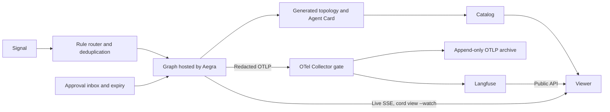

# Architecture

## Status and source of truth

Cordboard has a [minimal executable graph](docs/minimal-graph.md) with
in-memory execution records (#4), plus a separate archive integration (#5):
`cord-runtime`, OTel instrumentation, redaction, and Collector persistence.
[Archive setup and evidence](docs/archive.md) describe the runnable archive
fixture. The [archive escalation query](docs/archive-query.md) now validates
complete Run trees and returns deterministic Graph/Node counts (#6). The
[LiteLLM integration](docs/model-proxy.md) connects the graph to the archive
through explicit Attempts and a DB-free proxy (#8). Controlled endpoint tests
pass; real-provider compatibility remains unverified without operator credentials.
The [Aegra integration](docs/aegra.md) executes that graph through the public
API with Postgres checkpoints and verifies the complete archive path (#9).
The [switchboard boundary](docs/decisions/0013-switchboard-boundary.md) makes
LiteLLM optional and removes provider credentials from platform acceptance.
The separate real-provider example remains unverified; this is not a passed check.
The [Langfuse comparison](docs/langfuse.md) exports through the Collector gate to
a pinned self-hosted instance and verifies the same archive cohort through its
Public API (#10), including model-free execution.
The [`cord` CLI](docs/cord-cli.md) adds `cord add`/`cord list`/`cord run` over
`aegra_client.execute`, with board-level connection storage, bounded exit
statuses, and a distinct waiting status for a paused or still-running Run (#12).
The remaining platform lifecycle commands (`cord new`, `cord up`'s drift
handling, `cord sync`) are still planned.
[Interrupt/resume span boundaries](docs/interrupt-resume.md) close a Step as
`awaiting_approval` when the graph's own `interrupt()` pauses it and open a new,
linked Step on resume, through LangGraph's public interrupt contract rather
than any change to `agent-workflow-core` or Omiologic (#28).
[Approval expiry, halt, and repeated-execution evidence](docs/approval-expiry.md)
applies an injected-clock reminder/timeout policy to one already-known waiting
approval, resolves an approval-versus-timeout race to exactly one durable
disposition (`resumed` or `halted`) without forging a graph-specific rejection,
and flags a Step whose `cord.resumed_from` is shared by more than one other
Step as repeated-execution evidence in `cord view` (#15). `cord_runtime.
aegra_client.cancel` adds the one supported public halt action. Waiting-Run
discovery across Deployments and the authorized submission boundary remain
backlog per #14's own blockers, unchanged by this slice.
[Signal/Rule routing](docs/signal-routing.md) adds `cord rule add` and
`cord signal manual|file|schedule`, one generic router
(`cord_runtime.router.route_signal`) all three sources call, evaluating only
a Rule's declared match/mapping dot-paths against an already-registered
connection/Assistant (#12) without interpreting payload meaning; unmatched
Signals and invalid mappings are recorded with bounded, sanitized diagnostics
and no payload (#16).
`route_signal` now also durably deduplicates by Signal ID, applies a "skip"
default (Assistant, Subject) concurrency claim, and -- for a connection that
declares an operator-supplied ``launch`` command -- starts that managed
Deployment lazily before submission and marks it active (#17). All three are
file-backed claim stores under `.cordboard/` (`cord_runtime.signal_dedupe`,
`cord_runtime.concurrency`, `cord_runtime.deployment_lifecycle`) so they
survive a process restart between the claim and the outcome, not just a
retry within one process. A Signal ID is claimed only immediately before
submission and never rolled back afterward, since a failed or ambiguous
`execute()` result still means the Run may have been accepted; a Signal that
never reaches submission (unmatched, invalid mapping, concurrency skip, or a
managed Deployment that failed to start/become healthy) is not claimed, so a
corrected redelivery can still retry. `active_runs` is tracked per Deployment
alias, not per Graph, so one Graph on a shared Deployment going idle never
stops a sibling Graph's still-active Run; `cord deployment sweep` stops every
managed Deployment idle beyond its declared `idle_after` (default 600s;
Signal-ID retention default is 24h). A connection with no `launch` command
stays external and is never started or stopped, only ever contacted, as
before. `ensure_started` is written as the shared entry point a future
approval-resume submission would also call, but no resume orchestration
exists in this codebase yet to wire it into.
`route_signal` also chains a Run's completion into starting another,
independent Run (#18): once a matched Rule's execution reaches logical Run
terminal state (`execute()`'s own `"success"`, never each Aegra API Run
completion, so a pause/resume never fabricates a false cascade), the router
constructs that Run's own `run.finished` Signal (`cord_runtime.signals.
run_finished_signal`, platform-emitted rather than caller-supplied) and
routes it again through the same generic path, after this Run's own
concurrency/Deployment claims are released. A `run.finished` Rule declares a
required, non-empty `when` in place of the optional `match` the other three
Signal types use, and its `subject` is optional, defaulting to the completed
Run's own Subject (inheritance) with an explicit dot-path overriding it.
`cord_runtime.rules.add_rule` rejects a `run.finished` Rule whose `when`
statically pins the same (connection, assistant) pair it targets as a
self-loop; a longer cascade cycle is instead bounded at routing time by
`cord_runtime.router.MAX_CASCADE_DEPTH` (5) -- a `run.finished` Signal
already at that depth is blocked before any Rule is evaluated. Each cascade
child is a fresh `execute()` call (a new Thread/trace, never a `resume()` of
the Run that caused it) carrying the causing Run's id and the child's own
cascade depth through `config.configurable`
(`cord_caused_by_run_id`/`cord_cascade_depth`), so a graph that forwards them
into `cord_runtime.execution.run(..., caused_by_run_id=...,
cascade_depth=...)` records `cord.caused_by.run_id`/`cord.cascade.depth` on
its own new Run root span; a graph that ignores them still runs. Because
`run_finished_signal`'s id is deterministic on `run_id` alone, a redelivered
or re-derived completion shares the same #17 Signal-ID dedupe claim, so a
cascade fires at most once per completed Run.
[`cord_runtime.topology`](src/cord_runtime/topology.py) reads a Deployment's
optional published topology over HTTP, classifies it as absent, unreachable,
invalid, or valid against the pinned `agent-topology-spec==0.1.0b3` schema,
raises the R3 fan-out/interrupt warning, and tracks a local snapshot to detect
when a previously fetched document changed (#11). `cord sync`'s explicit
refresh CLI wiring remains planned, but `cord view` (#13) now calls
`check_freshness` directly to read the already-stored snapshot state.
[`cord_runtime.viewer`](src/cord_runtime/viewer.py) is the generic catalog:
`cord view` joins a connection's reachable Graphs (`/assistants`), optional
topology, and recorded execution read through the shared archive contract
(`cord_runtime.archive_query.role`/`parent`, reused rather than
reimplemented) purely by explicit `cord.*` identity. A drifted document is
shown stale and withheld from correlation; a topology document publishing
more than one Graph is shown present but also withheld from correlation,
since no explicit per-connection Deployment/Graph association storage exists
yet to disambiguate it (see [docs/viewer.md](docs/viewer.md)) (#13).
`cord view --watch` (#20) follows one Run's live Aegra SSE stream (`GET
/threads/{thread_id}/runs/{run_id}/stream`, Aegra 0.10.4's reconnect-safe
join endpoint) and reconciles it with recorded execution through
[`cord_runtime.live_reconciliation`](src/cord_runtime/live_reconciliation.py):
identity and lifecycle status only (`metadata`/`end`/`error` SSE frames;
`values`/`updates`/`messages*`/`debug` are dropped unread), model-free by
construction. A completed live Run stays visible while Langfuse ingestion is
pending, becomes a visible `ingestion_failed` diagnostic after a bounded
window rather than looping forever, and is dropped once its recorded
counterpart lands -- the durable record always replaces the temporary live
one. Reconnects rely on Aegra's own monotonic per-Run event ids, so a dropped
connection neither duplicates a Run entry nor loses progress. This is a
single-shot follow bounded by one `cord view` invocation, not a standing
daemon (see [docs/viewer.md](docs/viewer.md#live-runs-20)).

The [2026-09-15 internal dependency review](docs/internal-dependencies.md) records
the implemented core/domain libraries and Omiologic Aegra deployment. These are
now concrete integration inputs, but their existence is not Cordboard integration
evidence: Omiologic's issue graph still uses a no-op observer, and its topology
command generates files rather than serving the proposed discovery endpoint.

[Accepted ADRs](docs/decisions/DECISIONS.md) record decisions and their rationale.
Explicit corrections within an ADR take precedence over its older examples.
[docs/artifacts/cordboard.html](docs/artifacts/cordboard.html) summarizes the
design as of 2026-09-12, and
[docs/artifacts/cordboard-glossary.html](docs/artifacts/cordboard-glossary.html)
maps each shared word to its meaning in Cordboard documents (ADR-0002). Where
either disagrees with an ADR, the ADR wins. The
[upstream requirements](docs/decisions/cordboard-upstream-requirements.md) record
integration findings; conflicts with accepted decisions are identified below
rather than silently resolved. Dependency release statements in those documents
are dated observations, not a verified current compatibility matrix. The internal
dependency review separates released versions, candidate source and actual pins.

## Boundary and ownership

The platform knows a graph through its manifest, execution API, and spans. It
does not import graph business logic or understand graph-specific state fields,
prompts, tools, validation rules, model choices, or provider credentials. The graph's own process may import its code
to derive topology. This contract boundary is independent of process isolation.
The caller or an explicitly configured Rule selects the Graph/Assistant. Cordboard
connects that target and carries its API payload without interpreting the content
to select models or substitute another graph. A graph may use zero, one, or many
models without changing Cordboard configuration.

Two failure modes define the scope: a second monolith that must change for each
new graph, and a layer that adds nothing over using the underlying tools directly.

| Owner | Responsibility |
| --- | --- |
| Cordboard | Catalog, common execution vocabulary, topology/trace viewer, declarative Signal routing, graph lifecycle, approval inbox and expiry, archive integration |
| Graph | Business logic, state, deterministic validation, model selection, credentials, SDK/gateway configuration, retry and escalation decisions, interrupt placement, side-effect behavior |
| Aegra / LangGraph | Run execution, checkpointing, resume, cancellation, streaming, runtime recovery |
| Optional graph-owned gateway (e.g. LiteLLM) | Resolve the graph operator's model configuration; not a Cordboard prerequisite |
| OTel Collector | Enforce the redaction stamp and export accepted telemetry |
| Langfuse | Explore recorded execution through its Public API and UI |
| uv | Resolve and synchronize graph dependencies |
| [agent-topology](https://github.com/agent-topology/agent-topology) | Define and derive the framework-neutral topology format |
| [redact-secret](https://github.com/redact-secret/redact-secret) | Detect secrets and apply its public redaction policy API |

Cordboard does not own a new orchestration framework, dependency resolver,
telemetry query engine, evaluation platform, or production deployment system.

In the inspected internal stack, `agent-workflow-core` supplies neutral contracts
and LangGraph adapters; `git-agent` and `campaign-agent` own domain graphs; and
Omiologic owns the Aegra deployment, concrete resources and request-context bridge.
Cordboard connects to that deployment's public API. Those libraries need not be
installed in Cordboard. Core events/notifications are not automatically OTel spans
or Cordboard Signals, and entity approval validation remains outside the platform.

## Intended flow



The Graph is opaque here: model providers, tools and optional gateways are its
internal dependencies. Any additional telemetry producer follows the same redaction
contract. This shows the target system, not the minimum Slice 0 stack. The archive branch
comes first; Langfuse and the UI are introduced later.

## Identity and execution records

The definitions come from [ADR-0002](docs/decisions/0002-vocabulary.md),
[ADR-0003](docs/decisions/0003-subject-not-thread.md), and
[ADR-0008](docs/decisions/0008-outcome-split.md).

| Term | Meaning |
| --- | --- |
| Graph | Executable orchestration unit that accepts Runs and emits spans, and may publish a self-description; not a repository identity |
| Deployment | Addressable process hosting one or more Graphs |
| Assistant | Graph plus fixed configuration |
| Subject | Required opaque URI string identifying the external target of a Run |
| Run | One execution; one trace |
| Node | Static position in a Graph's topology |
| Step | One execution of a Node within a Run |
| Attempt | One try within a Step, recorded as a child span |
| Tier | Optional opaque graph-supplied annotation; no platform model mapping or ordering |
| Verdict | Graph-owned deterministic validation result, accompanied by violated rules |
| Outcome | Disposition of a Step or Attempt, using separate closed vocabularies |

For non-conversational graphs, a new Run gets a new Thread. Resume is intended
to continue the same logical Run and Thread; rerun starts fresh. Aegra 0.10.4
creates a new API Run ID even for resume. The Slice 0 client supports independent
executions only, mapping their API IDs to `cord.run.id`.
`cord_runtime.aegra_client.resume` now submits LangGraph's public
`command.resume` on an existing Thread, transporting the operator's answer
unread exactly like `execute()`'s `request_context`, and returns the new API
Run ID Aegra assigns it. `cord_runtime.run_continuity` durably groups that new
ID under the Thread's first API Run ID (#14, partial): this is the mapping
piece of the ADR-0003 correction, keyed on Deployment/Thread, not yet wired
into `cord view`, the CLI, or any graph. `cord_runtime.approval_expiry`
applies reminder/timeout/halt policy to one already-known waiting
(Deployment, Thread) pair keyed on that same logical `run_id`, and
`cord_runtime.aegra_client.cancel` adds the halt action itself (#15). A full
approval inbox — waiting-Run discovery across Deployments and the authorized
submission boundary — remains backlog per #14's own blockers; dedupe of
concurrent/stale *responses* (distinct from #15's repeated-*execution*
evidence in the viewer, which is span-based and already recorded) is not
implemented either.
Subject groups executions without
sharing checkpoint state and maps to Langfuse `session_id`. A conversational
graph may manage Thread reuse internally; the platform still groups by Subject.

```text
Run (trace)
└── Step (Node execution)
    ├── Attempt 1
    └── Attempt 2
        └── Optional graph-internal operation span
```

Step Outcomes are `passed`, `repaired`, `failed`, `awaiting_approval`, and
`halted`. Attempt Outcomes are `passed`, `failed`, and `escalated`.
`escalated` belongs only to Attempts and is declared by the graph when it chooses
a higher Tier; it is not inferred from changing provider model strings. The corrected
`fast → fast → deep` fixture records `failed → escalated → passed`: exactly one
escalation. A same-tier retry can succeed with no escalation. A deterministic
repair yields a `repaired` Step while retaining the original failed Attempt
and its violated rules.

## Generated discovery contracts

[ADR-0009](docs/decisions/0009-well-known-documents.md),
[ADR-0011](docs/decisions/0011-manifest-derivation.md), and
[ADR-0012](docs/decisions/0012-topology-spec-split.md) separate two documents a
Deployment may publish. Neither is required to connect or record a Graph
([ADR-0015](docs/decisions/0015-never-block-connection.md)): connecting needs a
reachable Deployment and the Graph the caller selects, and recording needs spans.
The topology manifest is optional input for the viewer.

- `/.well-known/agent-card.json`: the external A2A contract, with no Cordboard fields.
- `/.well-known/agent-topology.manifest.json`: internal structure in the
  independent topology format, exactly as the graph's producer emitted it.

The topology document always has a `graphs` array, including for one Graph.
This array convention does not redefine the A2A Agent Card format.

Cordboard does not describe graphs
([ADR-0014](docs/decisions/0014-no-graph-descriptors.md)). The graph process
calls `agent-topology` to derive structure from its compiled graph, and the graph
supplies its own display name (`compile(name=...)`). The document's
`graphs[].id` is an address inside that document, not an identity; a single-graph
document can keep the default `main`, and changing it changes `structureHash`.
Cordboard consumes the resulting JSON unchanged: it adds
no extension, rewrites no identity, and does not implement topology
introspection. Settings Cordboard needs in later slices describe connections —
deployments, triggers, Subject extraction, concurrency, approval expiry — never a
single graph. The upstream schema is authoritative for the precise wire format;
older `derived` wording in the ADRs is not a literal key.

Cordboard cannot re-derive structure from source without importing graph code
(ADR-0014), so it cannot itself confirm that a published document still
matches the running graph. `cord_runtime.topology` instead tracks a local
snapshot per Deployment endpoint and compares each fresh fetch's
document-level `structureHash` against it (#11): unchanged means the
published document has not moved since the last explicit refresh, not that
it matches the running code; changed means the picture behind the stored
snapshot is now stale and must not be shown as current until refreshed; and
an absent, unreachable, or invalid fetch leaves the stored snapshot untouched
and reports drift as unknown rather than either confirmed state. `cord sync`
is the explicit refresh path this snapshot store is built to serve once #12's
CLI calls it; source-file hashes and Mermaid text are not the comparison
contract. JSON is authoritative; Mermaid is a rendering aid.

Subgraphs default to opaque nodes (`depth=0`). Per-graph `completeness.gaps`
and general `producerLimitations` must both be visible; a producer limitation
does not itself make every document incomplete. These limitations are warnings.

The published beta.3 baseline loses parents at positive depth. The inspected
beta.4 candidate addresses this with retained parent nodes and child `graphs[]`
entries referenced by `subgraphId`; its qualification is recorded, publication
is pending. Positive-depth hashes change, and materialized graphs use experimental
interpretation revision `"2"`. Follow references rather than parsing graph IDs;
unknown interpretation revisions remain opaque. This is an upstream migration
consideration, not an installed Cordboard feature. See the
[versioned review](docs/internal-dependencies.md#topology-beta3-baseline-versus-beta4-candidate).

## Catalog validation

The catalog never refuses to connect a Graph
([ADR-0015](docs/decisions/0015-never-block-connection.md), replacing the rejection
rules of [ADR-0007](docs/decisions/0007-catalog-rejection.md)). What the manifest
can reveal is shown, not enforced:

| Manifest state | Catalog and viewer behavior |
| --- | --- |
| Absent | Connected and recorded normally; the viewer shows recorded execution without a topology |
| Present and valid | Topology drawn; recorded execution correlated against it |
| Present but schema-invalid | Document ignored with a warning; connection and recording unaffected |
| Drifted (R2) | Warning; the topology is shown as stale and recorded execution is not correlated against it |

A drifted picture is the harm ADR-0011 worried about, so the mitigation lives in
what the viewer displays rather than in a log line: a stale topology must never
look current. `cord_runtime.topology.fetch_topology`/`check_freshness` classify
the first three rows and the snapshot-drift half of the fourth (#11);
`cord_runtime.viewer`/`cord view` now consume them for all four rows (#13):
"Topology drawn" only when a `current` fetch's document is unambiguous (see
[docs/viewer.md](docs/viewer.md)'s Deployment/Graph association gap), and
"shown as stale" for a `changed` fetch.

R3 is a warning: an interrupt in a direct fan-out branch, judged from core
edge-kind and interrupt fields. It covers static interrupts only; dynamic
`interrupt()` calls are not visible in the topology and have no declaration path
(ADR-0014). Whether a fan-out runs all branches comes from `agent-topology`'s
experimental branch interpretation; when that is `unknown` or an unrecognized
revision, the warning says the condition cannot be confirmed. Warnings need no
override. `cord_runtime.topology.parallel_interrupt_warnings` implements this
judgment (#11).

Missing Agent Cards, derivation gaps, producer limitations, and unreachable
Deployments remain warnings or status information. A new rejection rule would
have to describe the connection rather than how a Graph is built, and satisfy
ADR-0007's three conditions: document-only judgment, effectively no false
positives, and silent or irreversible harm if allowed.

## Model and telemetry paths

[ADR-0013](docs/decisions/0013-switchboard-boundary.md) supersedes the shared
model-gateway requirement in ADR-0004. Graphs own model selection and all related
configuration. Cordboard neither requires a model list nor inspects gateway
routing rules. The optional LiteLLM example lives in `examples/model_proxy`;
its `fast`/`deep` policy is not a platform contract.

Run semconv `0.3.0` allows Attempts without `cord.tier` or any `gen_ai.*` data.
The archive query also reads existing `0.2.0` records under their original Tier
requirement. It counts graph-declared escalations without knowing model identity,
Tier ordering, or the number of models the graph uses.

[ADR-0006](docs/decisions/0006-masking-enforcement.md) places secret processing
inside each telemetry-producing process, before telemetry leaves it. Successful
processing stamps `cord.redacted=true`. The Collector drops unstamped spans;
it is a gate, not another secret detector. Direct Langfuse callbacks would bypass
that gate and are prohibited. Full prompts, diffs, and model outputs are not
span attributes.

The redactor is the public PyO3 binding `redact-secret==0.1.0b1`, pinned in
`cord-runtime`, using the upstream default policy. The exporter encodes with the
public OTel encoder, scans the complete span envelope, and stamps only success.
A `block` finding suppresses the whole span even when sanitized text is returned;
RS-1/RS-2 record the verified integration.
Custom detectors and `redaction.extra_patterns` were abandoned (RS-4).
Upstream now has a beta.2 release record, and Omiologic pins Python beta.2;
neither changes Cordboard's beta.1 pin or its recorded verification scope.
Later detector fixes at upstream HEAD remain unreleased in the inspected snapshot.
The implemented `archive-check` entrypoint wraps the pinned upstream CLI for
raw and decoded archive verification; `cord scan-archive` remains planned.

[ADR-0005](docs/decisions/0005-record-of-origin.md) makes date-partitioned,
append-only raw OTLP JSONL the record of origin. “Raw” describes the OTLP format,
not unredacted content. The archive receives only telemetry accepted by the gate.
Archive queries deduplicate retransmitted spans by `span_id`.

The escalation success criterion is answered directly from the archive. Slice
0 implements `archive-escalations`, a small Python query with fixed-time
fixtures and a verified Collector capture, without selecting a database engine.
It requires explicit `cord.graph.id` (Run semconv `0.2.0` or `0.3.0`), groups by Graph/Node,
and counts completed escalated Attempts in `(reference − 56 days, reference]`.
Old records without Graph identity fail with a re-emission diagnostic.
Langfuse is a second export destination in Slice 0.5. `langfuse-compare` reads
complete archived trace cohorts through the public v1 API of self-hosted 3.225.7,
waits for all observations with a deadline, and compares exact end-time counts.
Typed metadata and nanosecond strings are added only on the Langfuse branch;
the archive remains unchanged. Missing ingestion is distinct from an empty count.
Direct ClickHouse queries are temporary
investigation tools, not durable integration contracts.

## Isolation, routing, and approval

[ADR-0001](docs/decisions/0001-isolation-level.md) makes process isolation the
default per Graph, with explicit shared groups allowed. It is an operational
choice, not what keeps platform code independent of graph business logic.
Producer compatibility still constrains supported graph dependencies.

The design artifact proposes Signal sources including manual, file, schedule,
HTTP, and `run.finished`; manual, file, and schedule are implemented (#16).
Rules select an Assistant, map input, and extract a Subject. The router
deduplicates Signal IDs and applies "skip"-default concurrency policy on
`(Assistant, Subject)` (#17); unmatched Signals are also recorded.

Approval always carries `interrupt_id`. Graphs decide where to interrupt and
how to interpret the response; the platform owns the inbox and reminder/expiry
clock. Templates should separate interrupt nodes from side effects, because a
resumed node can execute again. Side-effect idempotency remains graph-owned.

Cross-graph composition is asynchronous through `run.finished`. A child Run
gets a new trace and records `cord.caused_by.run_id`; cascade depth uses
`cord.cascade.depth`. Synchronous composition stays inside a Graph as
subgraphs. Lazy startup landed with routing (#17): a connection that declares
an operator-supplied `launch` command is started on demand and stopped once
idle; a connection without one stays external and is only ever contacted, as
in the first slices. `run.finished` cascades themselves remain planned (#18).

## Open documentation issues

Review findings below are not new architecture decisions. Reconcile the relevant
sources before implementing the affected contracts; do not copy stale examples
as executable specifications.

| Finding | Sources and required follow-up |
| --- | --- |
| Wire examples span multiple topology revisions | ADR-0007/0011 retain literal `derived` references; ADR-0009/0012 use `structure`, and their Cordboard-extension examples are withdrawn by ADR-0014. ADR-0011 also mixes old source-hash/`derive.xray` text with structure-hash/`derive.depth` corrections. Validate against a pinned upstream schema before implementing. |
| ADR-0003 predates ADR-0002's mapping rule | Both HTML artifacts were rebuilt on 2026-09-12 with definitions and mappings instead of banned words. ADR-0003 still retains a banned-word reference; read it through ADR-0002's mapping rule and `cord.cascade.depth`. |
| ADR-0010 is unwritten | The index labels the DeepAgents template decision Accepted but explicitly says no ADR file exists. The design direction is recorded, but its formal ADR remains pending. |

The [upstream requirements](docs/decisions/cordboard-upstream-requirements.md)
record each `agent-topology` finding against its measured `0.1.0b3` behavior and
add the 2026-09-15 candidate-source update; AT-1 is addressed in beta.4
candidate source, and AT-6's supported range is unchanged. After ADR-0014 and
ADR-0015 none of them can block a connection; they affect viewer and warning
quality only. `agent-topology-spec==0.1.0b3` is pinned as a direct dependency
(#11) for schema validation and structure-hash comparison;
`agent-topology-langgraph` (the producer) is not and remains a graph-side
choice, since Cordboard only consumes published documents and never derives
structure itself. The [internal dependency review](docs/internal-dependencies.md#actual-integration-gaps)
records the remaining discovery, observer and resume integration gaps.
