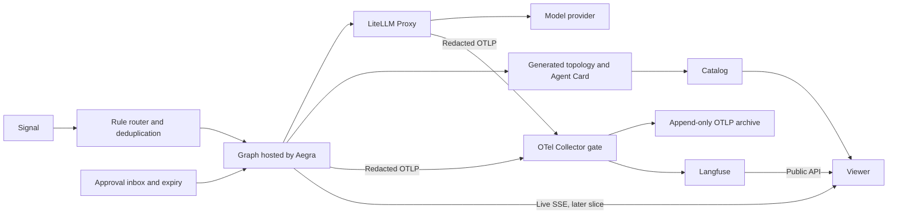

# Architecture

## Status and source of truth

Cordboard has a [minimal executable graph](docs/minimal-graph.md) with
in-memory execution records (#4), plus a separate archive integration (#5):
`cord-runtime`, OTel instrumentation, redaction, and Collector persistence.
[Archive setup and evidence](docs/archive.md) describe the runnable archive
fixture. The [archive escalation query](docs/archive-query.md) now validates
complete Run trees and returns deterministic Graph/Node counts (#6). The
[LiteLLM integration](docs/model-proxy.md) connects the graph to the archive
through explicit Attempts and a DB-free proxy (#8). Controlled endpoint tests
pass; real-provider compatibility remains unverified without operator credentials.
The [Aegra integration](docs/aegra.md) executes that graph through the public
API with Postgres checkpoints and verifies the complete archive path (#9).
Slice 0 remains open until the separate real-provider evidence is available.
The remaining platform and `cord` lifecycle commands are still planned.

[Accepted ADRs](docs/decisions/DECISIONS.md) record decisions and their rationale.
Explicit corrections within an ADR take precedence over its older examples.
The HTML artifacts explain the design but contain superseded material. The
[upstream requirements](docs/decisions/cordboard-upstream-requirements.md) record
integration findings; conflicts with accepted decisions are identified below
rather than silently resolved. Dependency release statements in those documents
are dated observations, not a verified current compatibility matrix.

## Boundary and ownership

The platform knows a graph through its manifest, execution API, and spans. It
does not import graph business logic or understand graph-specific state fields,
prompts, tools, or validation rules. The graph's own process may import its code
to derive topology. This contract boundary is independent of process isolation.

Two failure modes define the scope: a second monolith that must change for each
new graph, and a layer that adds nothing over using the underlying tools directly.

| Owner | Responsibility |
| --- | --- |
| Cordboard | Catalog, common execution vocabulary, topology/trace viewer, declarative Signal routing, graph lifecycle, approval inbox and expiry, archive integration |
| Graph | Business logic, state, deterministic validation, Tier choices and escalation decisions, interrupt placement, side-effect behavior |
| Aegra / LangGraph | Run execution, checkpointing, resume, cancellation, streaming, runtime recovery |
| LiteLLM Proxy | Resolve model aliases and handle availability within an alias |
| OTel Collector | Enforce the redaction stamp and export accepted telemetry |
| Langfuse | Explore recorded execution through its Public API and UI |
| uv | Resolve and synchronize graph dependencies |
| [agent-topology](https://github.com/agent-topology/agent-topology) | Define and derive the framework-neutral topology format |
| [redact-secret](https://github.com/redact-secret/redact-secret) | Detect secrets and apply its public redaction policy API |

Cordboard does not own a new orchestration framework, dependency resolver,
telemetry query engine, evaluation platform, or production deployment system.

## Intended flow



This shows the target system, not the minimum Slice 0 stack. The archive branch
comes first; Langfuse and the UI are introduced later.

## Identity and execution records

The definitions come from [ADR-0002](docs/decisions/0002-vocabulary.md),
[ADR-0003](docs/decisions/0003-subject-not-thread.md), and
[ADR-0008](docs/decisions/0008-outcome-split.md).

| Term | Meaning |
| --- | --- |
| Graph | Executable orchestration unit that describes itself, accepts Runs, and emits spans; not a repository identity |
| Deployment | Addressable process hosting one or more Graphs |
| Assistant | Graph plus fixed configuration |
| Subject | Required opaque URI string identifying the external target of a Run |
| Run | One execution; one trace |
| Node | Static position in a Graph's topology |
| Step | One execution of a Node within a Run |
| Attempt | One try within a Step, recorded as a child span |
| Tier | Model capability alias; distinct from the provider's model identifier |
| Verdict | Graph-owned deterministic validation result, accompanied by violated rules |
| Outcome | Disposition of a Step or Attempt, using separate closed vocabularies |

For non-conversational graphs, a new Run gets a new Thread. Resume is intended
to continue the same logical Run and Thread; rerun starts fresh. Aegra 0.10.4
creates a new API Run ID even for resume. The Slice 0 client supports independent
executions only, mapping their API IDs to `cord.run.id`; logical continuation
across multiple API invocations is deferred (ADR-0003 correction).
Subject groups executions without
sharing checkpoint state and maps to Langfuse `session_id`. A conversational
graph may manage Thread reuse internally; the platform still groups by Subject.

```text
Run (trace)
└── Step (Node execution)
    ├── Attempt 1
    └── Attempt 2
        └── Model-call span from the proxy
```

Step Outcomes are `passed`, `repaired`, `failed`, `awaiting_approval`, and
`halted`. Attempt Outcomes are `passed`, `failed`, and `escalated`.
`escalated` belongs only to Attempts and is declared by the graph when it chooses
a higher Tier; it is not inferred from changing provider model strings. The corrected
`fast → fast → deep` fixture records `failed → escalated → passed`: exactly one
escalation. A same-tier retry can succeed with no escalation. A deterministic
repair yields a `repaired` Step while retaining the original failed Attempt
and its violated rules.

## Generated discovery contracts

[ADR-0009](docs/decisions/0009-well-known-documents.md),
[ADR-0011](docs/decisions/0011-manifest-derivation.md), and
[ADR-0012](docs/decisions/0012-topology-spec-split.md) separate two documents:

- `/.well-known/agent-card.json`: the external A2A contract, with no Cordboard fields.
- `/.well-known/agent-topology.manifest.json`: internal structure in the
  independent topology format, with Cordboard policy under `x-cord`.

The topology document always has a `graphs` array, including for one Graph.
This array convention does not redefine the A2A Agent Card format.

`cord.yaml` supplies human declarations such as Subject extraction, Tier policy,
approval, concurrency, and triggers. The graph process calls `agent-topology`
to derive structure from its compiled graph. Cordboard consumes the resulting
JSON and composes its extension; it does not implement topology introspection.
The upstream schema is authoritative for the precise wire format: older
`derived`/`declared` terminology describes ownership, not reliable literal keys.

`cord up` is intended to compare freshly derived structure with the published
structure hash and refuse startup on drift. `cord sync` is the explicit refresh
path. Source-file hashes and Mermaid text are not the comparison contract.
JSON is authoritative; Mermaid is a rendering aid.

Subgraphs default to opaque nodes (`depth=0`). Per-graph `completeness.gaps`
and general `producerLimitations` must both be visible; a producer limitation
does not itself make every document incomplete. These limitations are warnings,
not independent reasons to refuse registration.

## Catalog validation

[ADR-0007](docs/decisions/0007-catalog-rejection.md) limits rejection to:

| Rule | Point | Reason |
| --- | --- | --- |
| R1 | Registration | Required derived topology is missing |
| R2 | Startup | Derived structure differs from the published structure |
| R3 | Registration | An interrupt is in a parallel branch covered by the rule |

R3 uses core edge-kind and interrupt fields according to the ADR's 2026-09-11
correction. Static interrupts can be derived; dynamic interrupts depend on
author declarations. Undeclared dynamic calls cannot be discovered from the
topology alone. Cross-framework parallel semantics remain an upstream question
(AT-3), so the rule is not evidence of a universal guarantee.

R3 has an explicit `unsafe.allow_parallel_interrupt` override with persistent
catalog/viewer disclosure. R1 and R2 have no override. Other conditions, such as
partial policy declarations, missing Agent Cards, or unreachable Deployments,
produce warnings or status information. A rejection must explain the rule,
cause, and repair. New rejection rules must satisfy the ADR's three conditions:
document-only judgment, effectively no false positives, and silent or
irreversible harm if allowed.

## Model and telemetry paths

[ADR-0004](docs/decisions/0004-model-gateway.md) makes LiteLLM the shared model
gateway. Graphs request aliases rather than provider identifiers. Same-alias
availability routing is allowed; cross-alias fallback must not conceal graph-owned
escalation. Fixed capability aliases such as `embed` do not imply a Tier ladder.

[ADR-0006](docs/decisions/0006-masking-enforcement.md) places secret processing
inside both graph and proxy processes, before telemetry leaves them. Successful
processing stamps `cord.redacted=true`. The Collector drops unstamped spans;
it is a gate, not another secret detector. Direct Langfuse callbacks would bypass
that gate and are prohibited. Full prompts, diffs, and model outputs are not
span attributes.

The redactor is the public PyO3 binding `redact-secret==0.1.0b1`, pinned in
`cord-runtime`, using the upstream default policy. The exporter encodes with the
public OTel encoder, scans the complete span envelope, and stamps only success.
A `block` finding suppresses the whole span even when sanitized text is returned;
RS-1/RS-2 record the verified integration.
Custom detectors and `redaction.extra_patterns` were abandoned (RS-4).
The implemented `archive-check` entrypoint wraps the pinned upstream CLI for
raw and decoded archive verification; `cord scan-archive` remains planned.

[ADR-0005](docs/decisions/0005-record-of-origin.md) makes date-partitioned,
append-only raw OTLP JSONL the record of origin. “Raw” describes the OTLP format,
not unredacted content. The archive receives only telemetry accepted by the gate.
Archive queries deduplicate retransmitted spans by `span_id`.

The escalation success criterion is answered directly from the archive. Slice
0 implements `archive-escalations`, a small Python query with fixed-time
fixtures and a verified Collector capture, without selecting a database engine.
It requires explicit `cord.graph.id` (Run semconv `0.2.0`), groups by Graph/Node,
and counts completed escalated Attempts in `(reference − 56 days, reference]`.
Old records without Graph identity fail with a re-emission diagnostic.
Langfuse is a second export destination in Slice 0.5, with its Public API used
for exploration and comparison. Direct ClickHouse queries are temporary
investigation tools, not durable integration contracts.

## Isolation, routing, and approval

[ADR-0001](docs/decisions/0001-isolation-level.md) makes process isolation the
default per Graph, with explicit shared groups allowed. It is an operational
choice, not what keeps platform code independent of graph business logic.
Producer compatibility still constrains supported graph dependencies.

The design artifact proposes Signal sources including manual, file, schedule,
HTTP, and `run.finished`. Rules select an Assistant, map input, and extract a
Subject. The router deduplicates Signal IDs and applies concurrency policy on
`(Assistant, Subject)`; unmatched Signals must also be recorded.

Approval always carries `interrupt_id`. Graphs decide where to interrupt and
how to interpret the response; the platform owns the inbox and reminder/expiry
clock. Templates should separate interrupt nodes from side effects, because a
resumed node can execute again. Side-effect idempotency remains graph-owned.

Cross-graph composition is asynchronous through `run.finished`. A child Run
gets a new trace and records `cord.caused_by.run_id`; cascade depth uses
`cord.cascade.depth`. Synchronous composition stays inside a Graph as subgraphs.
Lazy startup is planned with routing in Slice 3, not assumed for the first slices.

## Open documentation issues

Review findings below are not new architecture decisions. Reconcile the relevant
sources before implementing the affected contracts; do not copy stale examples
as executable specifications.

| Finding | Sources and required follow-up |
| --- | --- |
| Wire examples span multiple topology revisions | ADR-0007/0011 retain literal `derived` references; ADR-0009/0012 use `structure` and `x-cord`. ADR-0011 also mixes old source-hash/`derive.xray` text with structure-hash/`derive.depth` corrections. Validate against a pinned upstream schema before implementing. |
| R3 index summary is stale | The decision index's 2026-09-10 summary calls R3 LangGraph-only; ADR-0007 explicitly retracts that on 2026-09-11. AT-3 still asks for confirmation of parallel semantics. |
| Vocabulary artifacts predate ADR-0002 | Both HTML artifacts retain banned-word rules or old Graph/Manifest definitions; ADR-0003 also retains a banned-word reference. Use context-sensitive mappings, contract-based Graph identity, and `cord.cascade.depth`. |
| ADR-0010 is unwritten | The index labels the DeepAgents template decision Accepted but explicitly says no ADR file exists. The design direction is recorded, but its formal ADR remains pending. |

The upstream log additionally tracks expanded-subgraph identity (AT-1), sentinel
semantics (AT-2), joins (AT-4), graph-name ownership (AT-5), version support
(AT-6), and the resolved exporter integration (RS-1). It also records a beta.2 test
environment while ADR-0011 still proposes a beta.1 dependency pin. These are
topology integration inputs to verify, not installed topology dependencies.
